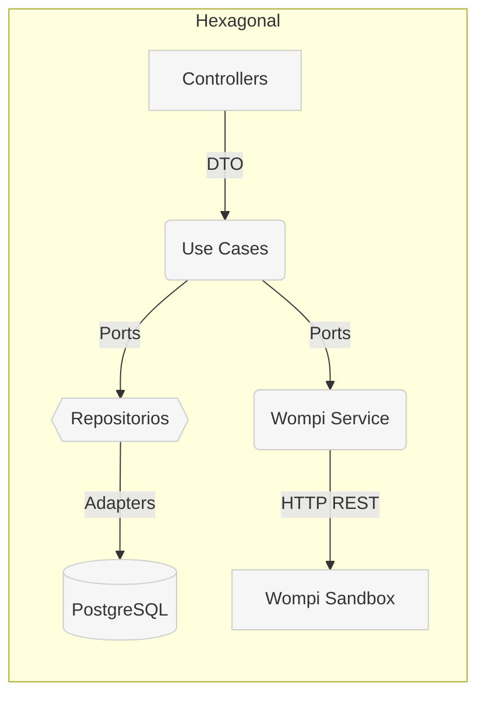
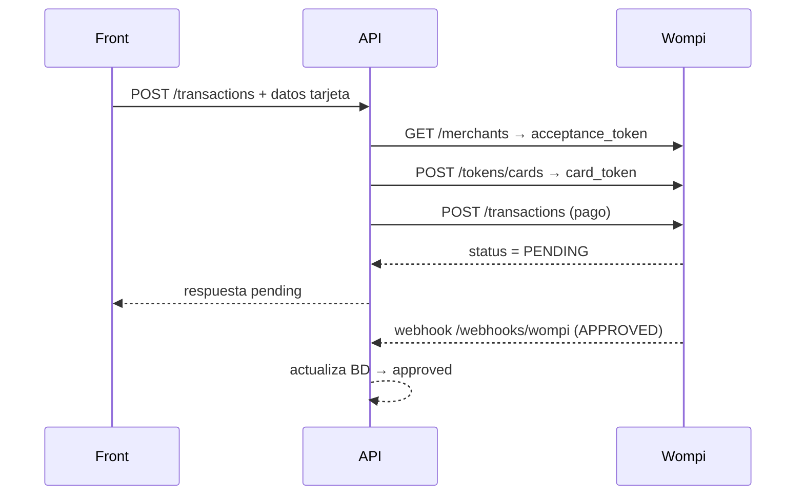

# 🏦 Wompi Payment API — Backend NestJS  
_Proyecto Full‑Stack de prueba_


---

## Índice
1. [Arquitectura](#arquitectura)  
2. [Estructura de carpetas](#estructura-de-carpetas)  
3. [Requisitos previos](#requisitos-previos)  
4. [Configuración rápida](#configuración-rápida)  
5. [Arranque en Docker](#arranque-en-docker)  
6. [Flujo de pago con Wompi](#flujo-de-pago-con-wompi)  
7. [Colección cURL / Postman](#colección-curl--postman)  
8. [Tareas npm](#tareas-npm)  
9. [Migraciones y seeds](#migraciones-y-seeds)  
10. [Pruebas y calidad](#pruebas-y-calidad)  
11. [Licencia](#licencia)

---

## Arquitectura



**Características principales:**

- **Hexagonal / Ports & Adapters**: cada módulo (product, transaction, etc.) mantiene las carpetas domain, dto, ports y adapters.
- **WompiModule** encapsula toda la integración externa.
- **PostgreSQL 15** corre en su propio contenedor (db).
- **Docker multi-stage** compila TypeScript y genera una imagen ultraligera.

## Estructura de carpetas

```
src/
 ├─ modules/
 │   ├─ product/
 │   ├─ transaction/
 │   ├─ customer/
 │   ├─ delivery/
 │   └─ wompi/
 │       ├─ adapters/
 │       ├─ dto/
 │       ├─ ports/
 │       ├─ wompi.service.ts
 │       └─ wompi.module.ts
 ├─ app.module.ts
 └─ main.ts
```

## Requisitos previos

| Herramienta | Versión mínima |
|-------------|----------------|
| Docker | 20.10 |
| Docker Compose | 1.29 |
| Node.js (opcional) | 18 LTS |
| Git | 2.30 |

> Si usas Docker para todo, Node y Postgres locales no son necesarios.

## Configuración rápida

```bash
git clone https://github.com/<tu-usuario>/payment-api.git
cd payment-api

# Variables de entorno
cp .env.example .env             # Rellena llaves y credenciales

# Arranque
docker-compose up -d --build
```

Abre `http://localhost:3000/health` y verás:

```json
{"status":"ok"}
```

## Arranque en Docker

```bash
docker-compose up -d --build      # Crea y levanta api_1 + db_1
docker-compose logs -f api        # Sigue logs de Nest
docker-compose exec api npm run migration:run  # Ejecutar migraciones
```

| Servicio | Puerto |
|----------|--------|
| API Nest | 3000 |
| PostgreSQL | 5432 |

## Flujo de pago con Wompi



## Colección cURL / Postman

```bash
# 1️⃣ Tokenizar tarjeta
curl -X POST "$WOMPI_BASE_URL/tokens/cards" \
  -H "Authorization: Bearer $WOMPI_PUBLIC_KEY" \
  -H "Content-Type: application/json" \
  -d '{"number":"4242424242424242","cvc":"123","exp_month":"12","exp_year":"25","card_holder":"Test"}'

# 2️⃣ Crear transacción vía backend
curl -X POST http://localhost:3000/transactions \
  -H "Content-Type: application/json" \
  -d '{
        "description":"Venta Demo",
        "amount":25000,
        "customerEmail":"test@ejemplo.com",
        "cardToken":"tok_test_ABC123..."
      }'
```

> Importa `docs/postman_collection.json` para probar todos los endpoints en Postman.

## Tareas npm

| Comando | Descripción |
|---------|-------------|
| `npm run start:dev` | Hot-reload con ts-node-dev |
| `npm run build` | Compila TypeScript a dist/ |
| `npm run lint` | ESLint + Prettier |
| `npm run test` | Unit + e2e tests (Jest) |
| `npm run migration:run` | Ejecuta migraciones TypeORM |
| `npm run seed` | Seeds de demostración |

## Migraciones y seeds

```bash
docker-compose exec api npm run migration:generate -- -n init   # Crear migración
docker-compose exec api npm run migration:run                   # Aplicarlas
docker-compose exec api npm run seed                            # Insertar demo
```

## Pruebas y calidad

- **Jest + Supertest** para unitarias y e2e
- **ESLint & Prettier** con husky + lint‑staged en pre‑commit
- **(Opcional)** SonarQube / SonarCloud para cobertura y análisis estático

## Licencia

MIT License - Ver [LICENSE](LICENSE) para más detalles.